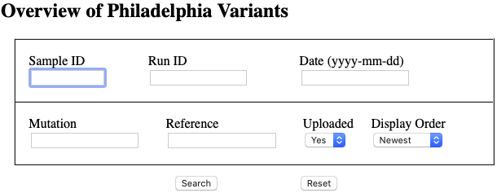
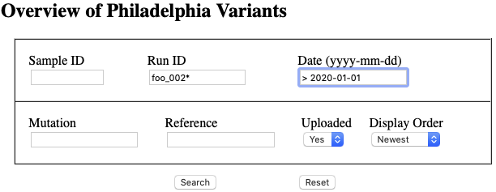
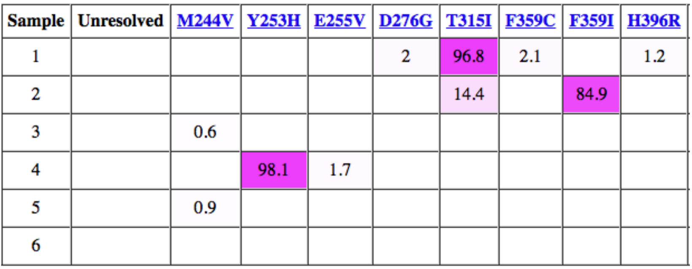
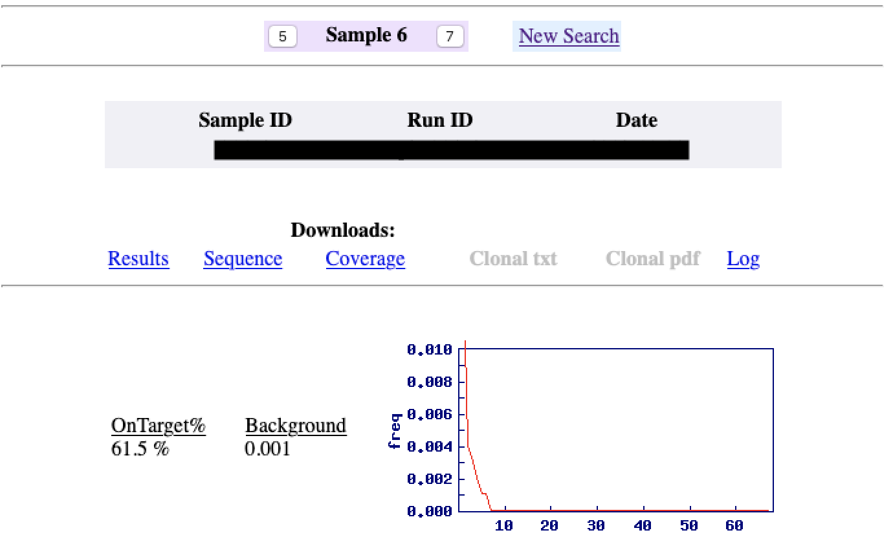
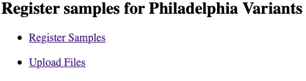

## Usage notes for storage and reporting frontend

### Clinic
Clamp users start with a blank search screen:

Values can be entered into these fields to limit the results. 
In the image below, the search has been limited to Run IDs starting with "foo_002"
(note the use of "*" as a wildcard) and a Date greater than 2020-01-01
(note the use of ">" as a comparator and yyy-mm-dd format).

After clicking *Search*, a list of hits will appear, showing the calculated
percentages of any any mutations found. Some fields omitted for clarity.

Clicking on the numbers in the left-most column will bring up a detailed view 
for that sample including access to raw data files. Details unavailable to the current sample
(eg, no clonal distribution for samples with fewer than ywo mutations). The navigation panel at the top
can be used to view other selected samples.

### Technicians
Data upload is done through the Admin Page.

